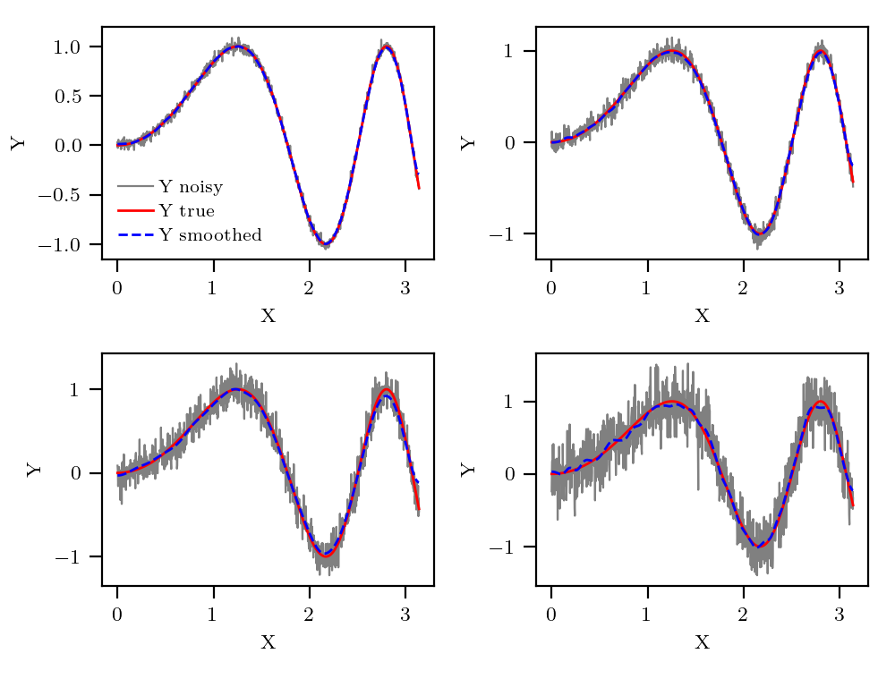
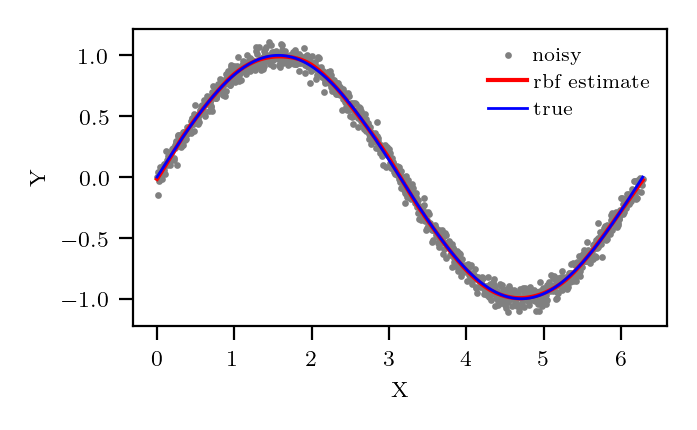

# KissSmoothing.jl
This package implements a denoising procedure, a Radial Basis Function estimation procedure and a Natural Cubic Splines estimation procedure.

## Denoising

    denoise(V::Array; factor=1.0, rtol=1e-12, dims=ndims(V), verbose = false)

smooth data in `V` according to:

    `V` : data to smooth

    `factor` : smoothing intensity

    `rtol` : relative tolerance on how precise the smoothing intensity is determined

    `dims` : array dimension being smoothed

    `verbose` : enables some printing of internal info

returns a tuple (S,N) where:

    `S` : is the smoothed data

    `N` : is the extracted noise

in particular `S + N` reconstructs the original data `V`.


### Example

```julia
using KissSmoothing, Statistics, LinearAlgebra
using PyPlot
figure(figsize=(5,4))
for (i,s) in enumerate(2 .^ LinRange(-1.5,1.5,4))
    # generating a simple sinusoidal signal
    X = LinRange(0,2pi,1000)
    Y = sin.(X)
    # generate it's noise corrupted version
    TN = std(Y).*randn(length(X))./7 .*s
    raw_S = Y .+ TN
    # using this package function to extract signal S and noise N
    S, N = denoise(raw_S)

    subplot(2,2,i)
    plot(X,raw_S, color="gray",lw=0.8, label="Y noisy")
    plot(X,Y,color="red",label="Y true")
    plot(X,S,color="blue", ls ="dashed",label="Y smoothed")
    xlabel("X")
    ylabel("Y")
    i==1 && legend()
end
tight_layout()
savefig("test.png")
```


### Multidimensional example
```julia
using KissSmoothing, Statistics, LinearAlgebra
using PyPlot
figure(figsize=(5,4))
for (i,s) in enumerate(2 .^ LinRange(-1.5,1.5,4))
    # generating a simple circle dataset
    X = LinRange(0,10pi,1000)
    Y = sin.(X) .+ randn(length(X))./7 .*s
    Z = cos.(X) .+ randn(length(X))./7 .*s
    M = [Y Z]
    O = [sin.(X) cos.(X)]
    # using this package function to extract signal S and noise N
    S, N = denoise(M, dims=1)

    subplot(2,2,i)
    scatter(M[:,1],M[:,2], color="gray",s=2,label="noisy")
    plot(S[:,1],S[:,2], color="red",lw=1.5,label="smoothed")
    plot(O[:,1],O[:,2], color="blue",lw=1.0,label="true")
    i==1 && legend()
    xlabel("X")
    ylabel("Y")
end
tight_layout()
savefig("test_multi.png")
```


## RBF Estimation

    fit_rbf(xv::Array, yv::Array, cp::Array)

fit thin-plate radial basis function according to:

    `xv` : array NxP, N number of training points, P number of input variables

    `yv` : array NxQ, N number of training points, Q number of output variables

    `cp` : array KxP, K number of control points, P number of input variables

returns a callable RBF object.

### Example

```julia
using PyPlot, KissSmoothing
t = LinRange(0,2pi,1000)
ty = sin.(t)
y = ty .+ randn(length(t)) .*0.05
fn = fit_rbf(t,y,LinRange(0,2pi,20))
scatter(t, y, color="gray",s=2,label="noisy")
plot(t, fn(t), color="red",lw=1.5,label="rbf estimate")
plot(t,ty, color="blue",lw=1.0,label="true")
xlabel("X")
ylabel("Y")
legend()
tight_layout()
savefig("rbf.png")
```



## NSplines Estimation

    fit_nspline(xv::Vector, yv::Vector, cp::Vector)

fit natural cubic splines basis function according to:

    `xv` : array N, N number of training points

    `yv` : array N, N number of training points

    `cp` : array K, K number of control points

returns a callable function.

### Example

```julia
using PyPlot, KissSmoothing
t = LinRange(0,pi,1000)
ty = sin.(t.^2)
y = ty .+ randn(length(t)) .*0.05
fn = fit_nspline(t,y,LinRange(0,2pi,20))
scatter(t, y, color="gray",s=2,label="noisy")
plot(t, fn.(t), color="red",lw=1.5,label="nspline estimate")
plot(t,ty, color="blue",lw=1.0,label="true")
xlabel("X")
ylabel("Y")
legend()
tight_layout()
savefig("nspline.png")
```


## Sine Series Estimation

    fit_sine_series(X::Vector, Y::Vector, basis_elements::Integer, noise=0)

fit Y ~ 1 + X + Σ sin(.) by minimising Σ (Y - f(x))^2 + lambda * ∫(Δ^order F)^2

    `X` : array N, N number of training points.

    `Y` : array N, N number of training points.

    `basis_elements` : number of sine terms.
    
    Keyword arguments:
    
    `lambda` : intensity of regularization.
    
    `order` : derivative to regularise.

returns a callable function.

### Example

```julia
using PyPlot, KissSmoothing
fg(x) = sin(x^2) + x
x = collect(LinRange(0,pi,250))
xc = identity.(x)
filter!(x->(x-1)^2>0.1, x)
filter!(x->(x-2)^2>0.1, x)
y = fg.(x) .+ randn(length(x)) .*0.05
fn = fit_sine_seris(x,y,20, lambda = 0.00001)
scatter(x, y, color="gray",s=2,label="noisy")
plot(xc, fn.(xc), color="red",lw=1.,label="fit")
plot(xc,fg.(xc), color="blue",lw=0.7,label="true")
xlabel("X")
ylabel("Y")
legend()
tight_layout()
savefig("sine_fit.png")
```

